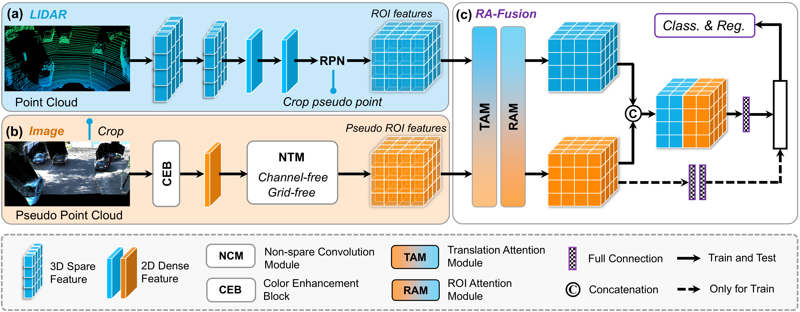

# MPCF: Multi-Phase Consolidated Fusion for Multi-Modal 3D Object Detection with Pseudo Point Cloud
<div align="center">
[Pan Gao](https://github.com/GP-Bone) <sup>1, </sup>,
[Ping Zhang](https://github.com/ELOESZHANG) <sup>1,✉* </sup>,
<br>
<sup>1</sup> UESTC
<br>
</div>

   We propose a multi-phase consolidated fusion (MPCF) framework, a multimodal network favoring uniform spatial distribution for 3D object detection.


This is the official implementation of [**MPCF**], built on [`SFD`](https://github.com/LittlePey/SFD) and [`OpenPCDet`](https://github.com/open-mmlab/OpenPCDet) 


### 🔥 Highlights

* **Strong performance**. MPCF achieves **SOTA** performance on kitti test set for single-use data. [`KITTI Benchmark`](https://www.cvlibs.net/datasets/kitti/eval_object.php?obj_benchmark=3d)💪

* **More friendly**. MPCF utilizes less than **7 GB** during training and  **~3 GB** during inference. (i.e., RTX 3090, RTX4090 are enough to train our MPCF). 😀

\


### Model Zoo
We release the model based on KITTI Dataset.

* All models are trained with 1 RTX-3090 or 4 RTX-4090 GPUs and are available for download. 

* As for KITTI validation set, the models are trained with train split (3712 samples).

* As for KITTI test set, please use slightly score (~0.5) threshold and train the models on all training data to achieve a desirable performance.

|                                             |Modality|GPU memory| Easy | Mod. | Hard  | download | 
|---------------------------------------------|----------:|----------:|:-------:|:-------:|:-------:|:---------:|
| [mpcf-val](tools/cfgs/kitti_models/mpcf.yaml)|LiDAR+RGB|~7GB (train)/~3 GB(val) |95.97 |89.67| 86.89| [google]() / [baidu]() | 
| [mpcf-test](tools/cfgs/kitti_models/mpcf_can.yaml)|LiDAR+RGB |~7GB (train)/~3 GB(val)| 92.46 |85.50 |80.69 | [google]() / [baidu]() |


### Installation
1.  Prepare for the running environment. 

    You can  follow the installation steps in [`OpenPCDet`](https://github.com/open-mmlab/OpenPCDet). We use 1 RTX-3090 or 4 RTX-4090 GPUs to train our MPCF.

2. Prepare for the data.  
    
    The dataset is follow [`SFD`](https://github.com/LittlePey/SFD). Anyway, you should have your dataset as follows:

    ```
    MPCF
    ├── data
    │   ├── kitti_pseudo
    │   │   │── ImageSets
    │   │   │── training
    │   │   │   ├──calib & velodyne & label_2 & image_2 & (optional: planes) & depth_dense_twise & depth_pseudo_rgbseguv_twise
    │   │   │── testing
    │   │   │   ├──calib & velodyne & image_2 & depth_dense_twise & depth_pseudo_rgbseguv_twise
    │   │   │── gt_database
    │   │   │── gt_database_pseudo_seguv
    │   │   │── kitti_dbinfos_train_custom_seguv.pkl
    │   │   │── kitti_infos_test.pkl
    │   │   │── kitti_infos_train.pkl
    │   │   │── kitti_infos_trainval.pkl
    │   │   │── kitti_infos_val.pkl
    ├── pcdet
    ├── tools
    ```
    .

3. Setup.

    ```
    conda create -n MPCF_env python=3.8
    conda activate MPCF_env
    
    pip install torch==2.0.0+cu117 torchvision==0.15.1+cu117 torchaudio==2.0.1+cu117 -f https://download.pytorch.org/whl/torch_stable.html
    (or:  pip install torch==1.9.1+cu111 torchvision==0.10.1+cu111 torchaudio==0.9.1 -f https://download.pytorch.org/whl/torch_stable.html)
    pip install -r requirements.txt
    pip install spconv-cu116 (or spconv-cu111)

    cd MPCF
    python setup.py develop
    
    cd pcdet/ops/iou3d/cuda_op
    python setup.py develop

    ```

### Getting Started

   You can find the training and testing commands in tools/GP_run.sh

0. Creat kitti_pkl and GT  

    ```
    python -m pcdet.datasets.kitti.kitti_dataset_custom create_kitti_infos ../tools/cfgs/dataset_configs/kitti_dataset_custom.yaml
    ```
    
1. Training. (We recommend running on single GPU, and our optimal model was trained using just 1 GPU.)

    For single GPU 
    ```
    cd tools
    python train.py --gpu_id 0 --workers 1 --cfg_file cfgs/kitti_models/mpcf.yaml \
     --batch_size 1 --epochs 60 --max_ckpt_save_num 25 --fix_random_seed
    ```
    
    For 4 GPUs
    ```
    cd tools
    python -m torch.distributed.launch --nnodes 1 --nproc_per_node=4 --master_port 25511 train.py \
     --gpu_id 0,1,2,3 --launch 'pytorch' --workers 4 \
     --batch_size 4 --cfg_file cfgs/kitti_models/mpcf.yaml  --tcp_port 61000 \
     --epochs 60 --max_ckpt_save_num 30 --fix_random_seed
    ```

2. Evaluation.

    ```
    cd tools
    python test.py --gpu_id 1 --workers 4 --cfg_file cfgs/kitti_models/mpcf_test.yaml --batch_size 1 \
     --ckpt ../output/kitti_models/mpcf/default/ckpt/checkpoint_epoch_57.pth #--save_to_file 
    ```
    
## License

This code is released under the [Apache 2.0 license](LICENSE).
    
## Acknowledgements
We thank these great works and open-source repositories:
[OpenPCDet](https://github.com/open-mmlab/OpenPCDet), [SFD](https://github.com/LittlePey/SFD), and [Voxel-RCNN](https://github.com/djiajunustc/Voxel-R-CNN).

## Citation
